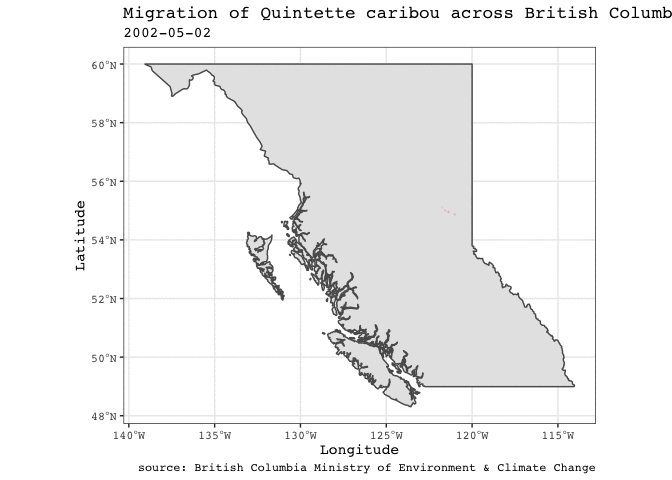

2020-06-23
================
Darren S Thomas
27 June, 2020

``` r
tuesdata <- tidytuesdayR::tt_load('2020-06-23')
```

    ## 
    ##  Downloading file 1 of 2: `locations.csv`
    ##  Downloading file 2 of 2: `individuals.csv`

``` r
ind <- tuesdata$individuals

loc <- tuesdata$locations
```

``` r
caribou <- loc %>% 
  # join sex var from ind to loc
  left_join(
    select(ind, animal_id, sex),
    by = "animal_id",
    keep = FALSE
  ) %>% 
  mutate(
    # extract date from timestamp
    date = as.Date(timestamp),
     # engineer calendar_year from timestamp
    calendar_year = year(timestamp)) %>% 
    # create a new var by uniting season and year
    unite(
      col = "season_year",
      season, calendar_year,
      sep = " ",
      remove = FALSE
    )
```

Do all herds have equal follow-up?

``` r
caribou %>% 
  group_by(study_site) %>% 
  summarise(
    start_followup = min(date),
    end_followup = max(date),
    length_followup = difftime(ymd(end_followup), ymd(start_followup), units = "days")
  ) %>% 
  arrange(desc(length_followup))
```

    ## # A tibble: 8 x 4
    ##   study_site  start_followup end_followup length_followup
    ##   <chr>       <date>         <date>       <drtn>         
    ## 1 Hart Ranges 1988-03-05     2007-02-12   6918 days      
    ## 2 Kennedy     2002-05-02     2016-07-31   5204 days      
    ## 3 Quintette   2002-05-02     2016-07-31   5204 days      
    ## 4 Moberly     2002-05-02     2015-03-18   4703 days      
    ## 5 Burnt Pine  2003-03-27     2013-10-07   3847 days      
    ## 6 Narraway    2006-12-20     2016-07-31   3511 days      
    ## 7 Graham      2001-02-21     2010-03-07   3301 days      
    ## 8 Scott       2013-03-25     2016-03-17   1088 days

We’ll study caribou from the Quintette herd/study, which has one of the
longest (recent) follow-up period.

``` r
caribou <- caribou %>% 
  filter(study_site == "Quintette")
```

# Cananda

Next, pull the geometry for Canada?

``` r
# pull geometry for Canada
canada <- rnaturalearth::ne_countries(
  country = "Canada",
  returnclass = "sf"
)
```

``` r
# # plot sf object directly
ggplot(data = canada) +
  geom_sf() +
  geom_point(
    data = caribou, 
    aes(x = longitude, y = latitude, colour = study_site),
    size = 0.1,
    alpha = 0.1)
```

<!-- -->

Where are the tracked caribou located? Seemingly only within the state
of Britisg Columbia. We’ll restrict our plot to this provicne only.

``` r
# pull geomotry for british columbia
bc <- rnaturalearth::ne_states(
  country = "Canada",
  returnclass = "sf"
) %>% 
  filter(name == "British Columbia")
```

Now, plot their temporal migration.

``` r
ggplot(data = bc) +
  geom_sf() +
  geom_point(
    data = caribou, 
    aes(x = longitude, y = latitude),
    size = 0.1,
    alpha = 0.1,
    colour = "#FF6666") +
  # animate
  transition_time(date
                    # optimise transitions
                    ) +
  shadow_wake(wake_length = 0.25) +
  labs(
    title = "Migration of Quintette caribou across British Columbia",
    subtitle = "{frame_time}",
    x = "Longitude",
    y = "Latitude"
  )
```

<!-- -->

``` r
# export to gif
anim_save(
  filename = "../output/2020-06-23.gif",
  animation = last_animation())
```

    ## R version 3.6.0 (2019-04-26)
    ## Platform: x86_64-apple-darwin15.6.0 (64-bit)
    ## Running under: macOS Mojave 10.14.6
    ## 
    ## Matrix products: default
    ## BLAS:   /Library/Frameworks/R.framework/Versions/3.6/Resources/lib/libRblas.0.dylib
    ## LAPACK: /Library/Frameworks/R.framework/Versions/3.6/Resources/lib/libRlapack.dylib
    ## 
    ## locale:
    ## [1] en_GB.UTF-8/en_GB.UTF-8/en_GB.UTF-8/C/en_GB.UTF-8/en_GB.UTF-8
    ## 
    ## attached base packages:
    ## [1] stats     graphics  grDevices utils     datasets  methods   base     
    ## 
    ## other attached packages:
    ##  [1] forcats_0.5.0   stringr_1.4.0   dplyr_1.0.0     purrr_0.3.4    
    ##  [5] readr_1.3.1     tidyr_1.1.0     tibble_3.0.1    tidyverse_1.3.0
    ##  [9] sf_0.9-4        lubridate_1.7.9 gganimate_1.0.5 ggplot2_3.3.1  
    ## 
    ## loaded via a namespace (and not attached):
    ##  [1] rnaturalearth_0.1.0      Rcpp_1.0.4.6             lattice_0.20-41         
    ##  [4] prettyunits_1.1.1        class_7.3-17             utf8_1.1.4              
    ##  [7] assertthat_0.2.1         digest_0.6.25            plyr_1.8.6              
    ## [10] R6_2.4.1                 cellranger_1.1.0         backports_1.1.7         
    ## [13] reprex_0.3.0             evaluate_0.14            e1071_1.7-3             
    ## [16] httr_1.4.1               pillar_1.4.4             rlang_0.4.6             
    ## [19] progress_1.2.2           curl_4.3                 readxl_1.3.1            
    ## [22] rstudioapi_0.11          blob_1.2.1               rnaturalearthhires_0.2.0
    ## [25] magick_2.3               rmarkdown_2.2            selectr_0.4-2           
    ## [28] munsell_0.5.0            broom_0.5.6              compiler_3.6.0          
    ## [31] modelr_0.1.8             xfun_0.14                pkgconfig_2.0.3         
    ## [34] rgeos_0.5-3              htmltools_0.4.0          tidyselect_1.1.0        
    ## [37] fansi_0.4.1              crayon_1.3.4             dbplyr_1.4.4            
    ## [40] withr_2.2.0              grid_3.6.0               nlme_3.1-148            
    ## [43] jsonlite_1.7.0           gtable_0.3.0             lifecycle_0.2.0         
    ## [46] DBI_1.1.0                magrittr_1.5             units_0.6-7             
    ## [49] scales_1.1.1             KernSmooth_2.23-17       cli_2.0.2               
    ## [52] stringi_1.4.6            farver_2.0.3             fs_1.4.1                
    ## [55] sp_1.4-2                 xml2_1.3.2               ellipsis_0.3.1          
    ## [58] generics_0.0.2           vctrs_0.3.1              tools_3.6.0             
    ## [61] glue_1.4.1               tweenr_1.0.1             hms_0.5.3               
    ## [64] yaml_2.2.1               colorspace_1.4-1         tidytuesdayR_1.0.0      
    ## [67] classInt_0.4-3           rvest_0.3.5              knitr_1.28              
    ## [70] haven_2.3.1
